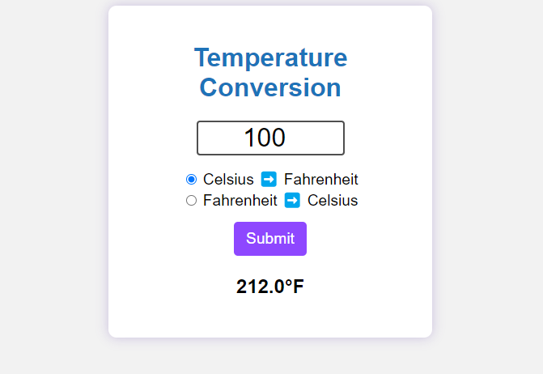

# Temperature-Conversion

A simple temperature conversion fahrenheit to celsius and vice versa

## Description

- A simple to use temperature conversion app.
- Click on the radio button to select how you want the temperature to be converted. Either from Celsius to Fahrenheit or Fahrenheit to Celsius.
- Type in what the temperature is.
- Click the Submit button.
- It will tell you what the temperature is.

[GitHub page](https://github.com/Digita1Panda/temperature-conversion)

[Temperature Conversion](https://digita1panda.github.io/temperature-conversion/)

## Installation

N/A

## Usage

## Credits

N/A

## License

MIT License

Copyright & All rights Reserved (c) 2023 Kwok Law

Permission is hereby granted, free of charge, to any person obtaining a copy of this software and associated documentation files (the “Software”), to deal in the Software without restriction, including without limitation the rights to use, copy, modify, merge, publish, distribute, sublicense, and/or sell copies of the Software, and to permit persons to whom the Software is furnished to do so, subject to the following conditions:

The above copyright notice and this permission notice shall be included in all copies or substantial portions of the Software.

THE SOFTWARE IS PROVIDED “AS IS”, WITHOUT WARRANTY OF ANY KIND, EXPRESS OR IMPLIED, INCLUDING BUT NOT LIMITED TO THE WARRANTIES OF MERCHANTABILITY, FITNESS FOR A PARTICULAR PURPOSE AND NONINFRINGEMENT. IN NO EVENT SHALL THE AUTHORS OR COPYRIGHT HOLDERS BE LIABLE FOR ANY CLAIM, DAMAGES OR OTHER LIABILITY, WHETHER IN AN ACTION OF CONTRACT, TORT OR OTHERWISE, ARISING FROM, OUT OF OR IN CONNECTION WITH THE SOFTWARE OR THE USE OR OTHER DEALINGS IN THE SOFTWARE.

---

## Badges

## Features

N/A

## Contributing

## Tests

N/A

---

Copyright © 2023 K.Law All Rights Reserved.
